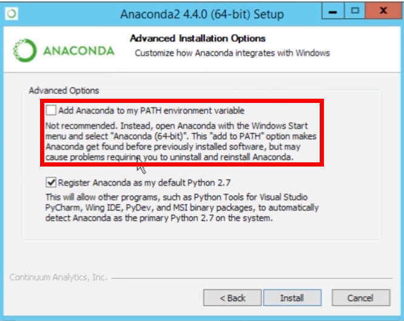
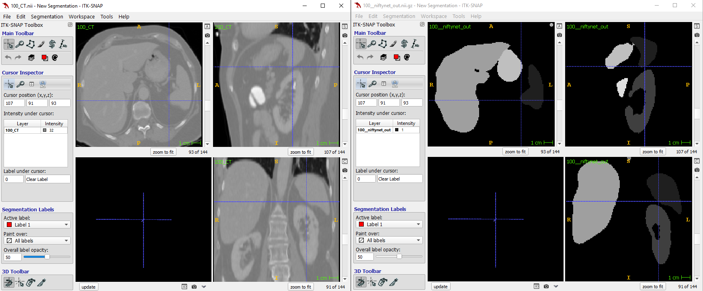

## NiftyNet Materials

### Help

- [NiftyNet Documentation](https://niftynet.readthedocs.io/en/dev/)
- [NiftyNet Mailing List](https://groups.google.com/forum/#!forum/niftynet)

### Youtube

- [NiftyNet: Deep Learning platform for medical image analysis - Jorge Cardoso (UCL)](https://www.youtube.com/watch?v=2OweR-sUNfQ&t=772s)
- [MED-NIPS 2017 - Jorge Cardoso](https://www.youtube.com/watch?v=ZaWStjGf0wg)
- [Deep Learning In Practice](https://www.youtube.com/watch?v=Q8lfkTXD69o&list=PLbj_N2x6keChr9xgCS9Y3MeBNV5OxikvI)

### Papers

- [Gibson and Li et al. 2017](https://reader.elsevier.com/reader/sd/pii/S0169260717311823?token=8FC4F5CFA48C0A830D84AA6D8995223F83400652CFC6CD97E864CAC631DB4154E8045BF53F865551B86B75666765CA92)
- [Li et al. 2017](https://arxiv.org/pdf/1707.01992.pdf)

### Demos (from niftynet github)

 - https://github.com/NifTK/NiftyNet/tree/dev/demos

## Install NiftyNet

### For Windows/Linux/Mac **WITH** GPU (modern Nvidia GPU)

- step 1: install Anaconda(python 3.7,64bit) (or Miniconda)

    [Anaconda download](https://www.anaconda.com/distribution/#download-section)
    
    Note: When installing, check add path!
    
    

- step 2: run the following command line by line in your terminal

    ```bash
    #create virtual env(A virual env will not mess your installed stuff)
    conda create -n niftynet_env -y python=3.6 conda pip tensorflow-gpu==1.12.0

    #enter virtual env. For Linux/Mac use `source activate niftynet_env`
    activate niftynet_env
    conda install -y -c anaconda opencv==3.4.2
    conda install -y -c simpleitk simpleitk==1.2.0
    conda install -y -c anaconda scikit-image==0.14.2
    pip install niftynet==0.5.0
    #leave virtual env. For Linux/Mac, use `source deactivate`
    deactivate
    ```

### For Windows/Linux/Mac **WITHOUT** GPU

- step 1: install Anaconda(python 3.7,64bit) (or Miniconda)
    
    [Anaconda download](https://www.anaconda.com/distribution/#download-section)
    
    Note: When installing, check add path!
    
    

- step 2: run the following command line by line in your terminal
    ```bash
    #create virtual env(A virual env will not mess your installed stuff)
    conda create -n niftynet_env -y python=3.6 conda pip tensorflow==1.12.0

    #enter virtual env. For Linux/Mac use `source activate niftynet_env`
    activate niftynet_env
    conda install -y -c anaconda opencv==3.4.2
    conda install -y -c simpleitk simpleitk==1.2.0
    conda install -y-c anaconda scikit-image==0.14.2
    pip install niftynet==0.5.0
    #leave virtual env. For Linux/Mac: use `source deactivate`
    deactivate
    ```
## Quick start

```bash
#enter virtual env. For Linux/Mac use `source activate niftynet_env`
activate niftynet_env
mkdir test_niftynet
cd test_niftynet
# note: the data and model will be saved to ~/niftynet, not your current directory!
net_download dense_vnet_abdominal_ct_model_zoo
net_segment inference -c ~/niftynet/extensions/dense_vnet_abdominal_ct/config.ini

#The segmentation output of this example application should be located at
~/niftynet/models/dense_vnet_abdominal_ct/segmentation_output/100__niftynet_out.nii.gz
```

## Check segmented results

You can use itk-snap to check the segmented results:




---
## Appendix
---

### Run NiftyNet with singularity container(note: Linux with GPU **only**)

```bash
# install singularity first
sudo apt-get install -y singularity-container

# pull sinularity image
singularity pull --name deeplearning_gpu.simg shub://yinglilu/deeplearning_gpu_singularity:1.0.0

# run NiftNet command: singularity exec --nv niftynet_gpu.simg <NiftyNet command> 

# for instance:
singularity exec --nv deeplearning_gpu.simg net_download dense_vnet_abdominal_ct_model_zoo

singularity exec --nv deeplearning_gpu.simg net_segment inference -c ~/niftynet/extensions/dense_vnet_abdominal_ct/config.ini

# Singularity bind your host $HOME to container's $HOME automatically. 
# The segmentation output of this example application should be located at
~/niftynet/models/dense_vnet_abdominal_ct/segmentation_output/100__niftynet_out.nii.gz

```

###  build your own singularity container by following:

- [github: deeplearning_gpu_singularity](https://github.com/yinglilu/deeplearning_gpu_singularity)
